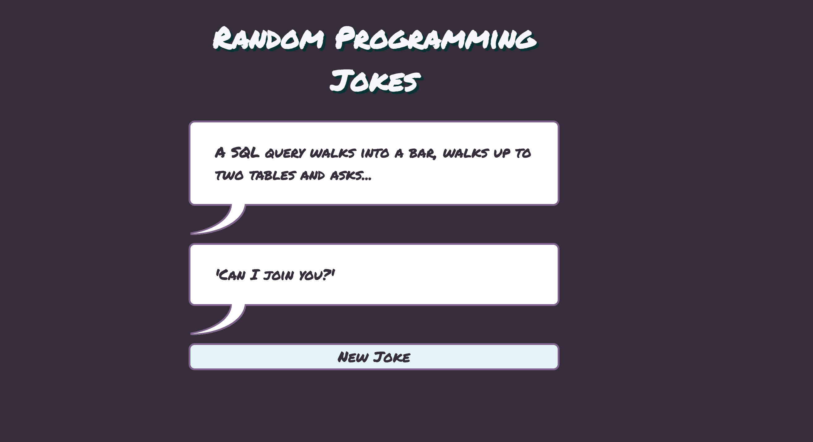

# Random Programming Jokes

Created this random jokes generator with Vanilla Javascript, HTML and CSS to practice fetch.

[Live Demo](https://stefi.codes/random-programming-jokes/)

## How it works

In order to get a joke click on the new joke button.

## Technologies

Javascript, HTML and CSS.
API: [https://official-joke-api.appspot.com](https://official-joke-api.appspot.com)

## Why I've build this game?

I wanted to play with fetch.

Repetition is key so I decided to build this game in order to practice more.
